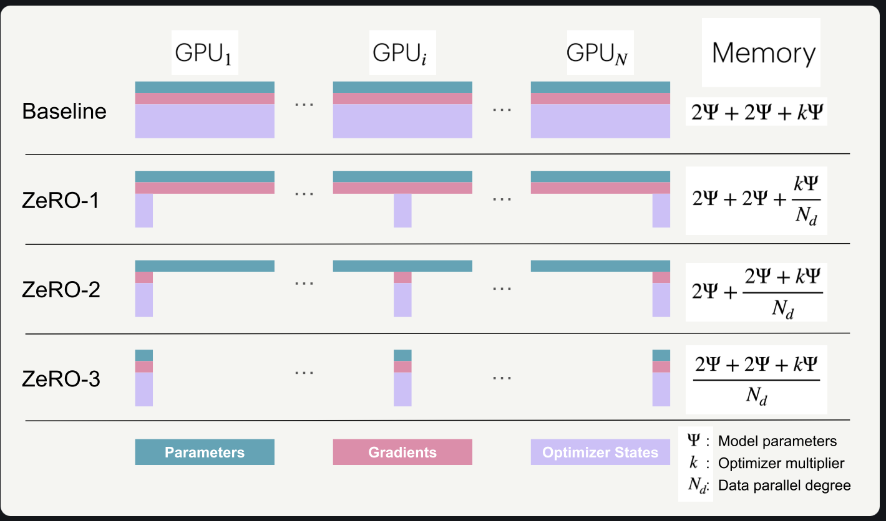

# Data Parallelism
**glossary:**
- all-reduce: 所有人交出自己的數據，算成一個平均值後，每個人都拿一份這個平均值回去

#### 讓梯度同步與反向傳播重疊
原本：等反向傳播完全結束才觸發 all-reduce
Now：只要某個參數的梯度就緒，就立刻觸發該參數的 all-reduce，此時其他參數的梯度仍在計算中

#### 梯度分桶（bucketing）
num of 梯度達到了，一次送，to 減少comm overhead

#### 與梯度累積的搭配
在樸素的版本中，累積期間每一次反向傳播結束都會自動觸發一次 all-reduce
只在最後一步之後做一次 reduce 就能達到相同效果 -> 在 PyTorch 中，典型的解法是為那些不需要 reduce 的反向傳播加上 model.no_sync() 修飾器來停用梯度同步。

global batch size中：
$$
gbs = mbs \times grad\_acc \times dp
$$

可以用$dp$的增加使$grad\_acc$減少：$dp$ as in 有多少個GPU在平行處理

## ZeRO（Zero Redundancy Optimizer，零冗餘優化器）
沿著資料平行維度切分優化器狀態、梯度與參數藉此消除記憶體冗餘（每個GPU都要裝一樣的、完整的optimizer state/gradient/param）。
- ZeRO-1：切分優化器狀態
- ZeRO-2：切分優化器狀態＋梯度
- ZeRO-3（亦稱 FSDP，即「完全分片資料平行」（Fully-Sharded Data Parallelism））：切分優化器狀態＋梯度＋參數

baseline的memory:
2Ψ: bf16的param
2Ψ: bf16的gradient
kΨ: fp32的param & optimizer state

- ZeRO-1：forward pass w/完整參數 -> backward pass 輸出完整梯度 -> reduce-scatter 即算完新的完整梯度後，各自拿各自負責的那一小part，無人存完整的 -> 根據自己的part更新param -> all-gather成新的完整參數

- ZeRO-2：原理同zero-1
- ZeRO-3：在forward跟backward傳播時，所需參數/梯度做on-demand all-gather。這聽起來似乎是很大的通訊開銷，但其實還好，因為我們可以用所謂的預取（prefetching），把下一層參數的通訊與當前層的前向傳播重疊。透過預取，我們在前向傳播算 Layer n 的同時「all-gather」Layer n+1 的權重；同樣地，在反向傳播算 Layer n 的同時「all-gather」Layer n-1 的權重。當然，這種重疊只有在 DP 規模不要拉得太大的前提下才成立（經驗法則是 DP 不應超過 512）。

---

# 🧪 對照我的實驗：DP / ZeRO 在 LoRA 情境下的預測值

> 完整推導與可重跑程式：`scripts/predict_memory_gemma.py`
> 這章是 slide 4 第五列「顯存分片的實際節省幅度」的理論基礎。
> **結論：在 LoRA 情境下，ZeRO-1 / ZeRO-2 幾乎沒有效果，只有 ZeRO-3 有意義。**
>
> ⚠️ 本章的假設 D1–D5 **本機一張機器做不了**（MLX 沒有 DP/ZeRO 實作）。
> 它們全部排在 Week 2 租卡那 2–4 小時，而且要租到 2 張卡。
> 租不到就在報告裡明確標示「理論分析，未實測」。

## 1. 先把筆記裡的 $2\Psi + 2\Psi + k\Psi$ 套到 Gemma 4 E4B

$\Psi = 7.46\text{B}$ 參數，Adam 混合精度下 $k = 12$（fp32 master 4 + m 4 + v 4）。
每 1 個「$\Psi$ 單位」= 7.46e9 bytes = **6.95 GiB**。

**假設是全參數微調**（課本的預設情境），單卡記憶體：

| 方法 | 公式（$N_d$ = DP 度數） | $N_d=2$ 時每卡 |
|---|---|---:|
| baseline（無分片） | $2\Psi + 2\Psi + k\Psi = 16\Psi$ | **111.2 GiB** |
| ZeRO-1（切優化器狀態） | $2\Psi + 2\Psi + \frac{k\Psi}{N_d}$ | 69.5 GiB |
| ZeRO-2（＋切梯度） | $2\Psi + \frac{(2+k)\Psi}{N_d}$ | 62.6 GiB |
| ZeRO-3 / FSDP（＋切參數） | $\frac{(4+k)\Psi}{N_d}$ | 55.6 GiB |

→ 全參數微調 Gemma 4 E4B 就算開 ZeRO-3、用 2 張卡，每卡仍要 55.6 GiB。
（換成 26B-A4B 的 $\Psi = 25.23$B，這四個數字全部再乘 3.4 倍。）

## 2. 用 LoRA —— ZeRO 的效果會不一樣

關鍵：ZeRO-1 / ZeRO-2 切的是**優化器狀態與梯度**，而這兩項都只對
**可訓練參數**生效（見 `ch01.md` Q2）。E4B LoRA r=16 的可訓練參數只有 **9.1M**，
所以 $\Psi_{train} = 9.1\text{M}$，整個 ZeRO-1/2 在切一個 0.135 GiB 的東西。

| 方法（$N_d=2$，4-bit 凍結權重 3.91 GiB） | 每卡 | 相對 baseline 省下 |
|---|---:|---:|
| baseline（單卡 4-bit LoRA） | 3.91 + 0.135 = **4.05 GiB** | — |
| ZeRO-1 | 3.91 + 0.085 = **4.00 GiB** | 0.051 GiB（**1.3%**） |
| ZeRO-2 | 3.91 + 0.076 = **3.99 GiB** | 0.059 GiB（**1.5%**） |
| ZeRO-3 / FSDP（bf16 base） | 13.9/2 + 0.068 = **7.02 GiB** | 切參數才有質變 |

**兩個要跟老闆講的結論：**

1. **ZeRO-1/2 對 LoRA 幾乎無效**，因為凍結的 3.91 GiB 基礎權重根本不在它們的切分範圍內。
   省下的 1.3–1.5% 在量測噪音的量級。
2. **只有 ZeRO-3 有意義**，因為它切的是參數本身 ——
   **價值不在「省記憶體」，在「讓原本塞不下的配置變成塞得下」。**
3. ⚠️ 但對 E4B 而言，連這個價值都用不上：bf16 版只要 13.9 GiB，**單機就放得下**。
   所以本章對主線模型是**純理論**；真正需要 ZeRO-3 的是 26B-A4B 的 bf16（47.0 GiB），
   那要 2×48GB 才有意義。這個「課本的解法在我的規模上用不到」本身就是誠實的結論。

## 3. 通訊量預測 —— LoRA 讓 DP 幾乎零通訊成本

筆記裡整理的三項優化（重疊、分桶、`no_sync()`）全都是為了對付
「梯度 all-reduce 太大」這個問題。用 ring all-reduce，每步搬移
$\frac{2(N_d-1)}{N_d} \times$ 梯度位元組。

| 情境（E4B, $N_d=2$） | 每步 all-reduce 量 | 在 PCIe 4.0 x16（~25 GB/s）約需 |
|---|---:|---:|
| 全參數微調（bf16 梯度 $2\Psi$） | 14.9 GB | **~0.60 秒** |
| **LoRA r=16, attn only（9.1M）** | **18.2 MB** | **~0.7 毫秒** |
| LoRA 含 FFN（34.9M） | 70 MB | ~2.8 毫秒 |
| 對照：26B MoE LoRA attn（11.5M） | 23 MB | ~0.9 毫秒 |

**預測 D1：LoRA + DP 的通訊開銷可以忽略，2 卡吞吐應該達到 1.9× 以上（效率 >95%）。**
換句話說，課本花整章講的重疊與分桶技巧，在我的實驗裡「應該看不出差別」——
而**證明看不出差別本身就是一個有價值的結果**：它量化了 LoRA 讓分散式訓練
變簡單的程度（通訊量從 14.9 GB 降到 18.2 MB，**降低 818 倍**）。

（同理，筆記裡的 `model.no_sync()` 在 LoRA 下也應該幾乎沒有效益，
因為被省下的 all-reduce 只有 18.2 MB。這也是一條可驗證的假設。）

## 4. 全域批次大小：$gbs = mbs \times grad\_acc \times dp$

筆記裡「可以用 $dp$ 的增加使 $grad\_acc$ 減少」這句，在我的實驗裡是這樣落地的。

固定 $gbs = 32$，`max_seq_len = 2048`，4-bit + 梯度檢查點：

| 配置 | 每卡可行 mbs 的依據 | mbs | grad_acc | dp | 預測吞吐 |
|---|---|---:|---:|---:|---|
| **本機 M4 Pro 24GB（MLX）** | bs=2 是 12.3 GiB；bs=4 就 19.6 GiB 貼邊（logits 隨 bs 線性） | 2 | 16 | 1 | 基準 1.0× |
| 租 48GB 單卡 | bs=8 約 38 GiB，還有餘裕 | 8 | 4 | 1 | ~1.3–1.5× |
| 2×48GB + DDP | 同上 | 8 | 2 | 2 | ~2.5×（通訊可忽略，見 D1） |

**課本情境與我的情境的落差**：課本假設你可以加卡來換掉 grad_acc，
我只有一台單機，所以 $dp$ 永遠是 1，**只能靠 mbs 與梯度累積**。
E4B 夠小讓 mbs 有調整空間（原本規劃的 12B 只能 mbs=1），
但仍碰不到課本真正在談的 DP 擴展問題。這一點要寫進 ch08 的三步驟對照。

## 5. Week 2/3 要驗證的假設（全部需要 2 張卡）

| # | 假設 | 驗證方式 |
|---|---|---|
| D1 | LoRA + DDP 2 卡吞吐 ≥ 1.9×（效率 >95%） | 單卡 vs 2 卡跑同樣步數，比 tok/s |
| D2 | ZeRO-1 相對 DDP 省下的記憶體 < 0.1 GiB（LoRA 下形同無效） | DDP vs ZeRO-1 各量峰值 |
| D3 | ZeRO-3 讓 **26B-A4B 的 bf16**（47.0 GiB）在 2×48GB 上跑得起來（單卡不行） | 直接試跑，記錄是否 OOM |
| D4 | `no_sync()` 開關對 LoRA 的 step time 影響 < 2% | 梯度累積 8 步，開關各跑 50 步 |
| D5 | 固定 gbs 下，dp 從 1→2 且 grad_acc 減半，loss 曲線應重合 | 同 seed 跑 200 步，疊圖比對 |

D5 是最容易被忽略、但最該做的一條：它驗證的是**分散式訓練的正確性**
（換了平行策略但數學上等價），而不只是速度。若 loss 曲線對不上，
表示實作有 bug，後面所有數字都不能信。

## 6. 誠實界定範圍

課本提到「DP 不應超過 512」——我的實驗規模是 1–2 卡，完全碰不到這個上限，
也碰不到 bucketing 的調參甜蜜點。**這一章我能實測的最多只有 DP=2 的最小案例，
其餘（大規模 DP 的通訊瓶頸、ZeRO 在數十卡上的擴展性）只做理論理解，
不宣稱驗證過。** 若連 2 卡都沒租到，整章都是理論分析。
這點要寫進報告，避免過度宣稱。
