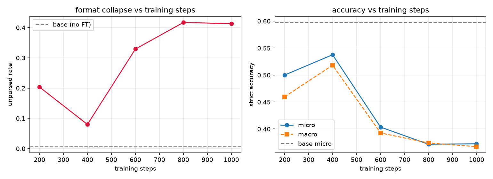

# checkpoint 掃描：訓練步數 vs 格式保留率

由 `scripts/sweep_checkpoints.sh` + `scripts/summarize_sweep.py` 產生。

```
    步數     題數     嚴格micro     嚴格macro      無法解析micro      無法解析macro     分鐘
--------------------------------------------------------------------------------
     0   1036      0.5975      0.5398         0.0068         0.0052     60   ← 未微調
   200   1036      0.5000      0.4596         0.2037         0.2371     61
   400   1036      0.5376      0.5183         0.0801         0.1150     60
   600   1036      0.4035      0.3927         0.3292         0.3258     60
   800   1036      0.3716      0.3740         0.4170         0.3971     59
  1000   1036      0.3726      0.3673         0.4131         0.4038     64
```



## 每個 checkpoint 實際評測的模型（對帳用）

| 步數 | model.name |
|---:|---|
| 200 | `out/fused-0000200` |
| 400 | `out/fused-0000400` |
| 600 | `out/fused-0000600` |
| 800 | `out/fused-0000800` |
| 1000 | `out/fused-0001000` |
